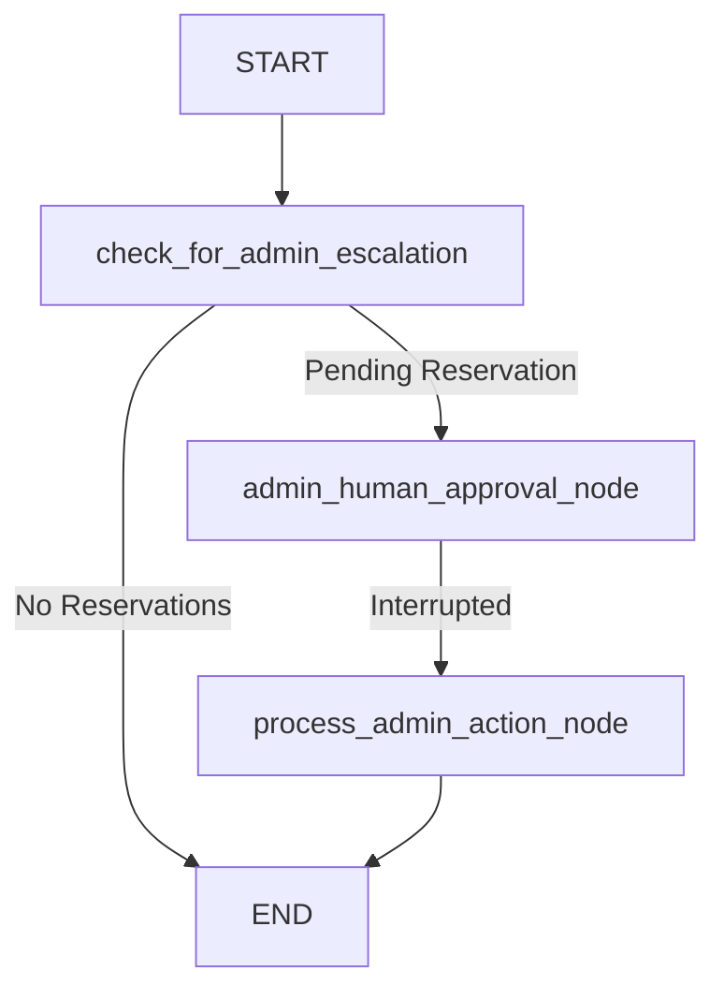

# Parking Chatbot Orchestrator - Stage 4
Final task for AI engineering Fast Track Course

## 🏗 System Architecture

This project is a multi-agent system built entirely on **LangGraph**. It replaces traditional linear scripting with a stateful graph where nodes are autonomous agents, human approvals, or API interactions.

The primary system relies on the `OrchestratorGraph` which maintains the global state (`OrchestratorState`). 

### Architecture Flow



1. **User Input** → Receives chat messages.
2. **Chatbot Node** → RAG LLM analyzes intent. If the user wants to book, it extracts constraints (Name, Plate, Time) and logs it as `pending` in SQLite.
3. **Escalation Router** → The graph checks the SQLite database for pending reservations.
4. **Admin Approval Node (Interrupt)** → If a pending reservation is found, the system *pauses execution* (`interrupt_before`), waiting for an Admin to provide an `approve/reject` state update.
5. **Action Node** → Processes the human decision. If approved, confirming the reservation in SQLite and routing the payload to the MCP Node.
6. **MCP Logging Server** → Uses the Model Context Protocol (FastMCP) to log the approved reservation asynchronously.

## 🤖 Agent & Server Logic

### 1. Chatbot Graph (`src/chatbot_graph.py`)
This is the front-line agent.
* **Logic**: Uses a secondary LangGraph subgraph. It routes incoming queries to a Retrieval-Augmented Generation (RAG) tool if the user asks for rules/pricing, or to a booking tool if they want a spot.
* **Output**: Updates the global state with `reservation_details` or `retrieved_docs`.

### 2. Admin & Escalation Logic (`src/orchestrator_graph.py`)
The orchestrator acts as the "manager" of the agents.
* **Logic**: After the chatbot finishes its turn, the orchestrator triggers `check_for_admin_escalation`. It queries the local SQLite DB for unapproved reservations.
* **Human-in-the-Loop**: By compiling the graph with `interrupt_before=["admin_human_approval_node"]`, LangGraph natively yields execution back to the caller (Terminal or Studio) until explicitly resumed with a payload (`action: 'approve'`).

### 3. MCP Server (`src/mcp_server.py`)
A fast, standardized interface for agent tooling.
* **Logic**: It runs a standalone `FastMCP` server exposing a `log_reservation` context tool. When the Orchestrator confirms a reservation, it connects to this server over `stdio` streams to document the confirmation securely, separating logging logic from core graph state.

---

## 🚀 Setup & Deployment Guidelines

### Prerequisites
- Python 3.12+
- OpenAI API Key
- LangSmith API Key (for LangGraph Tracing & Studio)

### Installation

1. **Clone and setup the environment:**
   ```bash
   python -m venv venv
   source venv/bin/activate
   pip install -r requirements.txt
   ```

2. **Configure Environment:**
   Create a `.env` file in the root directory:
   ```env
   OPENAI_API_KEY=sk-...your-key-here...
   LANGSMITH_API_KEY=lsv2_...your-key-here...
   LANGCHAIN_TRACING_V2=true
   LANGCHAIN_PROJECT=parking_bot
   ```

### 💻 Running Locally (CLI Deployment)

For local testing, the interactive CLI can be used. `main.py` is configured to simulate the entire system, handling both User interactions and Admin interrupts in the same terminal.

```bash
python main.py
```

1. Type a reservation request: `"Book a spot for Alice, car ABC, 10:00 to 12:00"`
2. The CLI will detect the LangGraph pause and display a prompt: `[ADMIN ALERT] Approve this reservation? (y/n/skip):`
3. Type `y`. The graph will resume, modify the database, log via MCP, and output the final bot response.

### 🌐 Deploying with LangGraph Studio

To run the system in a production-ready visual environment:

1. Install LangGraph CLI and run the developer studio:
   ```bash
   langgraph dev
   ```
2. Open the provided Localhost Web URL.
3. Select `orchestrator` in the bottom-left dropdown.
4. Chat with the bot. When a reservation is made, the execution trace will pause.
5. **To Approve**: Look at the right-hand **State** panel. Change the `action` field from `null` to `approve`.
6. Click the **Resume arrow** at the bottom of the screen.

### 🧪 Testing & CI/CD
- Run the full async integration suite locally:
  ```bash
  pytest -v
  ```
- **Load Testing**: Load validation via `test_load.py` is utilized to ensure high-concurrency memory checkpointer integrity under stress.
- **CI Pipeline**: A GitHub Action (`.github/workflows/test.yml`) protects the `main` branch by automatically running the test module.

---
## Generated Presentation
Presentation is in the `Parking_Bot_Presentation.pptx` file.
