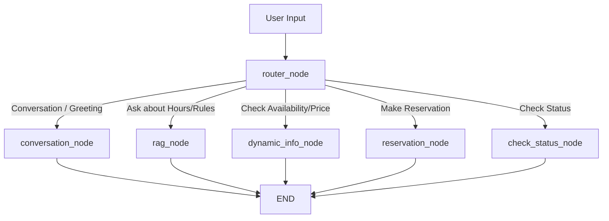

# Parking Chatbot - Stage 1
Final task for AI engineering Fast Track Course

## 🏗 System Architecture

This project is a stateful chatbot system built on **LangGraph**. It replaces traditional linear scripting with a stateful graph where nodes act as functional agents to handle parking availability queries, conversational engagement, and reservation slot-filling.

The primary system logic relies on the `chatbot_graph` which maintains the global state (`AgentState`). 

### Architecture Flow



1. **User Input** → Receives chat messages.
2. **Intent Routing (`router_node`)** → Analyzes the text utilizing a hybrid approach (keyword heuristics + LLM classification) to determine the user's goal.
3. **Execution Nodes**:
   - **RAG Node** → Contextualizes the query based on conversation history and retrieves static rules/facts from a Vector Store.
   - **Dynamic Info Node** → Bypasses the LLM entirely, querying the SQLite DB directly for real-time pricing and slot availability.
   - **Reservation Node** → Uses structured LLM extraction to slot-fill constraints (Name, Plate, Time). Keeps asking the user until all fields are provided, then logs the request in SQLite.
   - **Conversation Node** → Handles casual small talk and heuristically extracts the user's name.
   - **Check Status Node** → Queries the SQLite database to return the approval status of a user's reservation.

## 🤖 Agent & Server Logic

## 🤖 Agent Logic

### Chatbot Graph (`src/chatbot_graph.py`)
This is the front-line agent and the core of the application.
* **Logic**: It routes incoming queries to a Retrieval-Augmented Generation (RAG) tool if the user asks for rules/pricing, or to a booking tool if they want a spot. It inherently maintains conversation memory and lock-in states (like ensuring a reservation is fully filled out before proceeding).
* **Output**: Updates the global `AgentState` with conversational messages, `user_info` extraction, and `reservation_details`.

---

## 🚀 Setup & Deployment Guidelines

### Prerequisites
- Python 3.12+
- OpenAI API Key
- LangSmith API Key (for LangGraph Tracing & Studio)

### Installation

1. **Clone and setup the environment:**
   ```bash
   python -m venv venv
   source venv/bin/activate
   pip install -r requirements.txt
   ```

2. **Configure Environment:**
   Create a `.env` file in the root directory:
   ```env
   OPENAI_API_KEY=sk-...your-key-here...
   LANGSMITH_API_KEY=lsv2_...your-key-here...
   LANGCHAIN_TRACING_V2=true
   LANGCHAIN_PROJECT=parking_bot
   ```

### 💻 Running Locally (CLI Deployment)

For local testing, the interactive CLI can be used. It connects safely to the compiled LangGraph and includes intermediate PII redaction guardrails.

```bash
python main.py
```

1. Type a reservation request: `"Book a spot for Alice, car ABC, 10:00 to 12:00"`
2. The bot will process your request or ask follow-up questions if data is missing.
3. Chat naturally - the state memory will recall your name and car plate throughout the session.

### 🌐 Deploying with LangGraph Studio

To run the system in a production-ready visual environment:

1. Install LangGraph CLI and run the developer studio:
   ```bash
   langgraph dev
   ```
2. Open the provided Localhost Web URL.
3. Select `app` (from `src/chatbot_graph.py`) in the bottom-left dropdown.
4. Chat with the bot and view the state execution trace visually.

### 🧪 Testing & CI/CD
- Run the evaluation suite locally to test metrics like Answer Accuracy and Retrieval Recall:
  ```bash
  python evaluate.py
  ```
- **Guardrail Testing**: Ensure PII is redacted properly using `test_guardrails.py`.

---
## Generated Presentation
Presentation is in the `Parking_Bot_Presentation.pptx` file.
